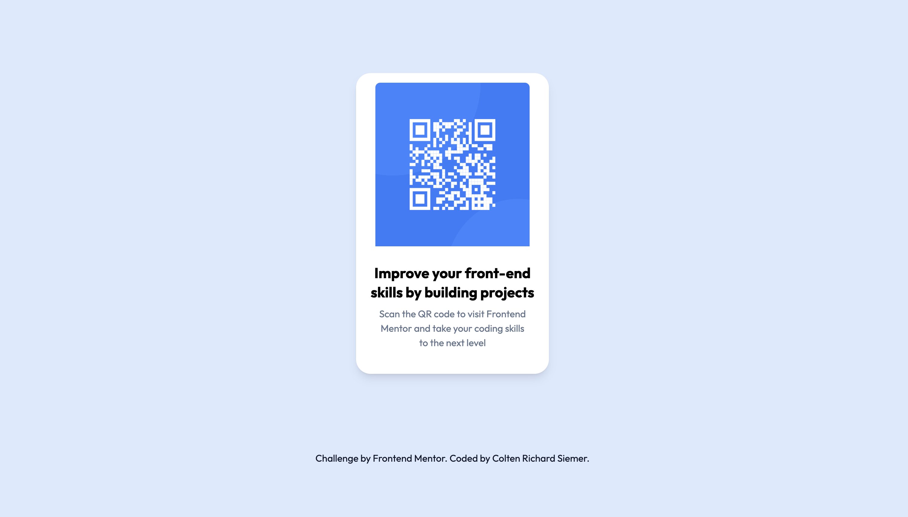

# Frontend Mentor - QR code component solution

This is a solution to the [QR code component challenge on Frontend Mentor](https://www.frontendmentor.io/challenges/qr-code-component-iux_sIO_H). Frontend Mentor challenges help you improve your coding skills by building realistic projects. 

## Table of contents

- [Overview](#overview)
  - [Screenshot](#screenshot)
  - [Links](#links)
- [My process](#my-process)
  - [Built with](#built-with)
  - [What I learned](#what-i-learned)
  - [Continued development](#continued-development)
  - [Useful resources](#useful-resources)
- [Author](#author)

**Note: Delete this note and update the table of contents based on what sections you keep.**

## Overview

### Screenshot

 

### Links

- Live Site URL: https://master--gregarious-kringle-1eed3e.netlify.app/

### Built with

- html
- tailwindCss
- [React](https://reactjs.org/) - JS library

### What I learned

This was a great way for me to start learning react-app. I also included to build with tailwind. 

One important part that I looked at was to learn accessibility with this project. As simple as it was, I learn that between text-fonts and backgrounds there needs to be a certain contrast. 

I used Depue tools to check for accessibilty. This really helped me make sure I was using best practices 

**Note: Delete this note and the content within this section and replace with your own learnings.**

### Continued development

I will contunie to develop and focus on react/tailwind. I really want to make an effort to learn more about accessibility to make sure all my apps are accessible from the start. 

### Useful resources

https://www.deque.com/ - accessibility tool

## Author

- Frontend Mentor - https://github.com/Coltensiemer
- Twitter - https://twitter.com/coltensiemer

**Note: Delete this note and add/remove/edit lines above based on what links you'd like to share.**

